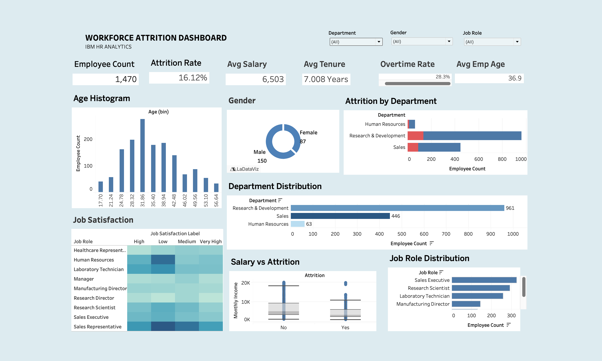
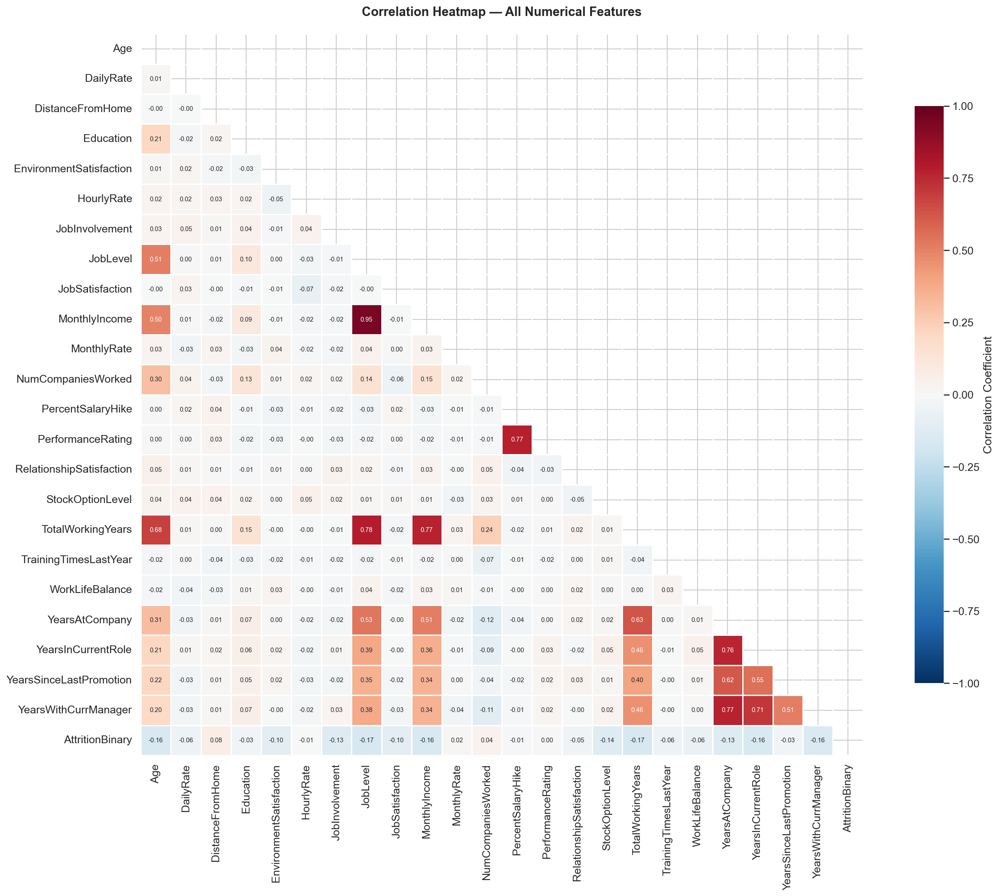
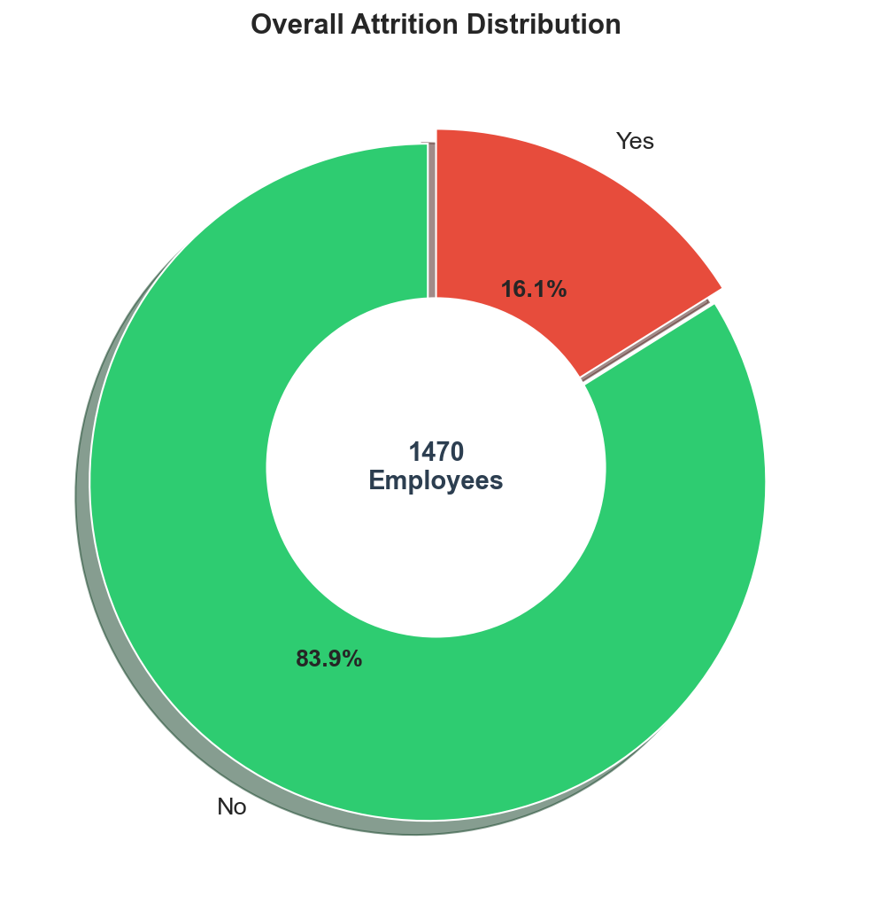
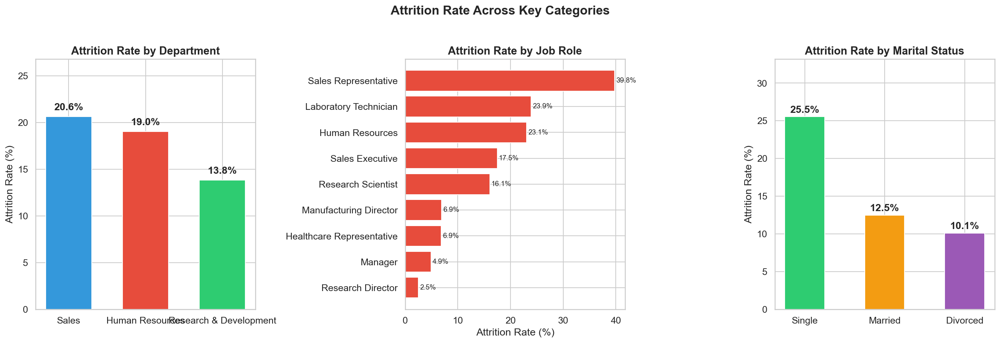
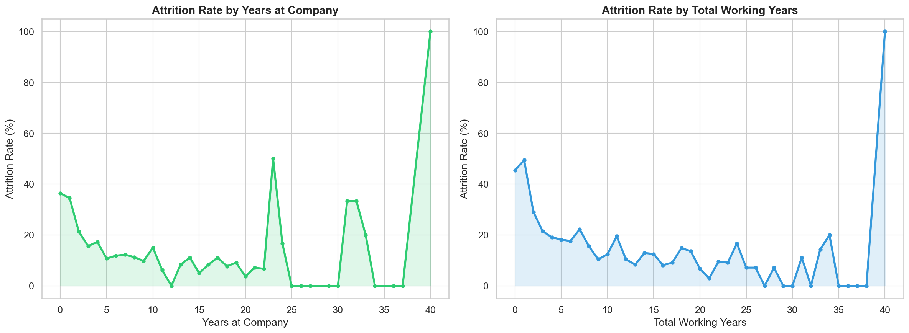

# Employee Attrition Analytics

## Table of Contents
1. [Overview](#overview)
2. [Problem Statement](#problem-statement)
3. [Dataset Information](#dataset-information)
4. [Tech Stack & Architecture](#tech-stack--architecture)
5. [Key Business Insights](#key-business-insights)
6. [Data Preprocessing Methodology](#data-preprocessing-methodology)
7. [Dashboard & Visualisations](#dashboard--visualisations)
8. [Important Links](#important-links)

## Overview
This project provides a comprehensive analysis of employee attrition using robust statistical methods and interactive data visualization. The primary objective is to identify structurally significant predictors of employee turnover, enabling data-driven retention strategies and optimized workforce planning initiatives.

## Problem Statement
Employee attrition represents a significant financial and operational liability. High turnover rates directly correlate with escalated recruitment costs, degradation of organizational knowledge, and decreased team productivity. This analysis isolates the root causes of attrition, facilitating targeted retention interventions that maximize human capital ROI.

## Dataset Information
The analysis utilizes the IBM HR Analytics Employee Attrition & Performance dataset.
- **Source:** IBM
- **Records:** 1,470 highly structured employee entries
- **Features:** 35 independent workforce variables
- **Target Variable:** `Attrition` (Binary Class: Yes/No)
- **Key Feature Categories:** 
  - Demographics (Age, Gender, Marital Status)
  - Role Information (Department, Job Role, Job Level)
  - Compensation & Benefits (Monthly Income, Stock Option Level)
  - Employee Satisfaction (Job Satisfaction, Environment Satisfaction, Work-life Balance)
  - Career Trajectory (Years at Company, Years in Current Role)

## Tech Stack & Architecture
- **Language:** Python (Pandas, NumPy, Matplotlib, Seaborn) utilized for robust Exploratory Data Analysis (EDA) and data transformations.
- **Visualization:** Tableau Desktop utilized for drafting dynamic, cross-filtering business intelligence dashboards.
- **Methodology:** ETL (Extract, Transform, Load) principles seamlessly applied locally via Python scripts prior to ingesting structured data into Tableau.

## Key Business Insights
The data interrogation yielded several immediate findings applicable to strategic intervention:
1. **Tenure Criticality:** Employees within an initial 0-2 year tenure window express the highest proportional attrition risk. Retention efforts should heavily target new-hire onboarding and early career development strategies.
2. **Compensation Correlation:** Income strongly and negatively correlates with attrition probability. Employees designated into the lowest salary brackets exhibit significantly elevated turnover incidence.
3. **Divisional Discrepancies:** The Sales and Human Resources departments yield above-average attrition risk. Most notably, the 'Sales Representative' role operates with high volatility.
4. **Job Satisfaction Factor:** Depressed composite scores across Job Satisfaction and Environment Satisfaction directly and strongly predispose employees to depart.

## Data Preprocessing Methodology
To construct an optimized analytical dataset, multiple curation requirements were programmaticly executed:
- **Redundancy Elimination:** Sanitized statically unified or non-informative fields (e.g., `EmployeeCount`, `StandardHours`, `Over18`).
- **Data Transformation:** Systematically binarized the `Attrition` target variable to facilitate mathematical correlation assessment.
- **Feature Engineering:** Constructed discrete binned categories mapping continuous variables (Age Bands, Tenure Bands, and Income Bands), which significantly improved exploratory filtering parameters.

## Dashboard & Visualisations

The interactive dashboard empowers stakeholders to dynamically filter complex attrition drivers across hierarchical segments. Summarized beneath are the dashboard outputs and pivotal supporting visualizations.

### 1. Interactive Dashboard View
A complete interactive interface incorporating cross-filtering controls for real-time exploratory investigations.

### 2. Structural Features Correlation Heatmap
A correlation heatmap identifying mathematically significant relationships intersecting the primary Attrition target.

### 3. Aggregate Macro Attrition Analysis 
A high-level quantitative split measuring retained baseline vs. historic turnover.

### 4. Granular Divisional Risk Segmentation
A structural view measuring divergent attrition outcomes relative to specific departments and associated job descriptions.

### 5. Career Lifecycle Risk Impact
A continuous timeline tracking peak attrition threat profiles aligned over early employee integration phases.

## Important Links
- **Project Structure & Code Repository:** [GitHub Repository](https://github.com/HardikShreays/employee-attrition-analytics-dashboard)
- **Tableau Public Dashboard:** *(Insert accessible Tableau link here if hosted)*
