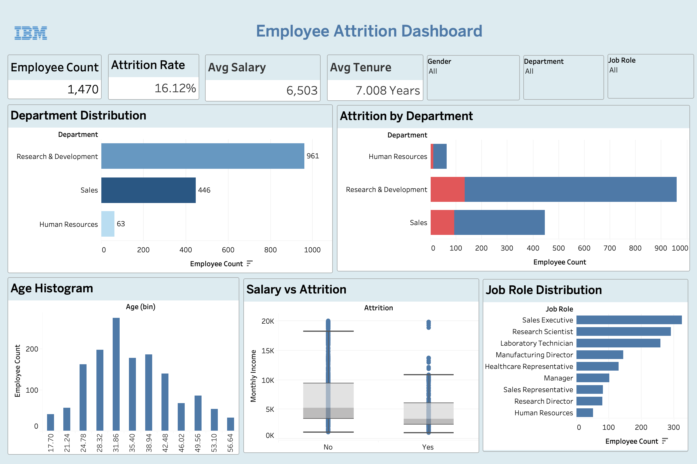

# 📊 Employee Attrition Analytics Dashboard

## 🔍 Overview

This project analyzes employee attrition using the **IBM HR Analytics dataset** to uncover key factors influencing employee turnover.

The goal is to combine **data preprocessing (Python)** with **interactive visualization (Tableau)** to generate actionable business insights.

---

## 🧠 Problem Statement

Employee attrition is a critical challenge for organizations.
Understanding *why employees leave* helps companies improve retention, reduce costs, and optimize workforce strategy.

---

## 🛠️ Tech Stack

* **Python** (Pandas, NumPy)
* **Tableau** (Dashboard & Visualization)
* Data Cleaning & Feature Engineering

---

## 🧹 Data Preprocessing (Python)

The dataset was cleaned and enhanced using Python:

### Key Steps:

* Removed redundant columns (`EmployeeCount`, `StandardHours`, `Over18`)
* Converted categorical attrition into binary format (`AttritionBinary`)
* Created meaningful categorical labels:

  * Education levels
  * Job satisfaction levels
  * Work-life balance categories
* Engineered new features:

  * **Age Bands**
  * **Tenure Bands**
  * **Income Bands**

This preprocessing significantly improved the **analytical depth** of the dashboard.

---

## 📊 Dashboard Features

### 🔢 Key KPIs

* Total Employees: **1470**
* Attrition Rate: **16.12%**
* Average Salary: **6503**
* Average Tenure: **7.0 years**

---

### 📈 Visualizations

* Department-wise employee distribution
* Attrition by department (stacked comparison)
* Age distribution histogram
* Salary vs Attrition (box plot)
* Job role distribution

---

### 🎛️ Interactivity

* Dynamic filters:

  * Department
  * Gender
  * Job Role
* Fully interactive dashboard with cross-filtering

---

## 💡 Key Insights

* 📉 **Sales department shows significantly higher attrition**
* 💰 **Lower income groups are more likely to leave**
* ⏳ **Employees with shorter tenure (0–2 years) have higher attrition**
* 🧠 **Job roles with lower satisfaction show higher churn**

---

## 🌐 Live Dashboard

👉 [View on Tableau Public](#) *(Add your link here)*

---

## 📸 Dashboard Preview



---

## 📁 Project Structure

```
employee-attrition-analytics/
│
├── data/
│   └── attrition_clean.csv
│
├── scripts/
│   └── clean_attrition.py
│
├── dashboard/
│   └── attrition_dashboard.twbx
│
├── images/
│   └── dashboard_preview.png
│
└── README.md
```

---

## 🚀 How to Run

1. Run Python script:

   ```bash
   python clean_attrition.py
   ```
2. Open Tableau file:

   * `attrition_dashboard.twbx`
3. Explore dashboard using filters

---

## 🎯 Project Type

📌 Portfolio Project — focused on **data analytics + visualization + storytelling**

---

## 💼 What This Project Demonstrates

* Data cleaning & feature engineering
* Analytical thinking & insight generation
* Dashboard design (UI/UX principles)
* Business-oriented problem solving

---

## 🔗 Future Improvements

* Predictive modeling (attrition prediction using ML)
* Deployment as a web dashboard (React + Flask)
* Real-time data integration

---

## 👨‍💻 Author

Built as part of a **data analytics & visualization portfolio**.

---

⭐ If you found this useful, consider starring the repo!
